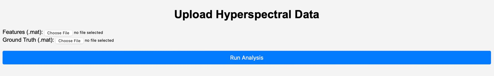
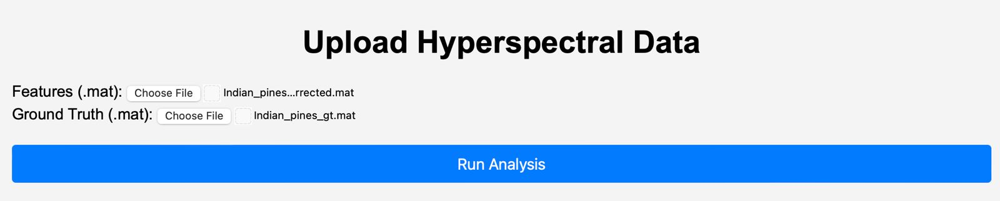
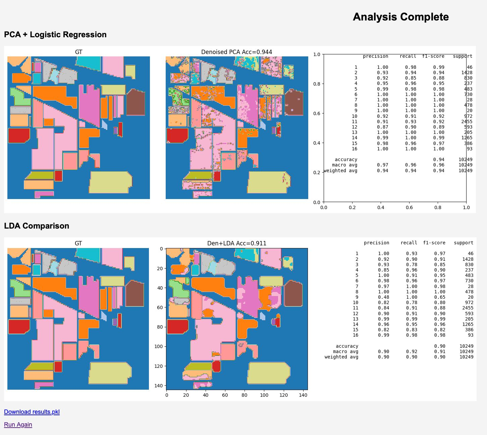

## analysis.ipynb
Contains all the analysis conducted on the outputs of Fischer's Linear Discriminant classification and PCA based Logistic Regressor.
Includes Exploratory Data Analysis done to further improve the accuracies and achieve 90%+ accuracy.

The results have been compiled up in results.md for quick access

Dataset used: Indian Pines dataset <href>https://www.ehu.eus/ccwintco/index.php/Hyperspectral_Remote_Sensing_Scenes</href>

### Further additions
## app.py
Web Application based GUI to analyze the predictions from PCA and LDA for various datasets, with ability to regenerate any previous plots.

This generates a server on the port <href>http://127.0.0.1:5000</href> after it is run, where you can upload your files to get predictions and accuracy from both LDA and PCA.

You can also get plots from any previous submissions by downloading the pickle file from the results page and reuploading it.

### Running instructions for the GUI
1. Clone this repo
2. install the dependencies(all the libraries)
```bash
pip3 install requirements.txt
```
3. Run the app.py
```bash
python3 app.py
```
4. This should run a webpage on the port <href>http://127.0.0.1:5000</href>

5. On this page, you can upload your hyperspectral cube in .mat format along with the ground truth file. The files for the Indian Pines dataset ahs been provided on the repo, you could run that for sample

6. Run submit, this should start the processing for the files, and in 5-6 seconds, you shall be redirected to the results page.

7. From there, you can view the plots, and can download the pickle file containing the prediction data, using which you can replot these later without reuploading the files.


