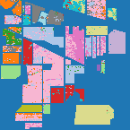
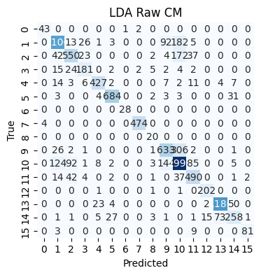
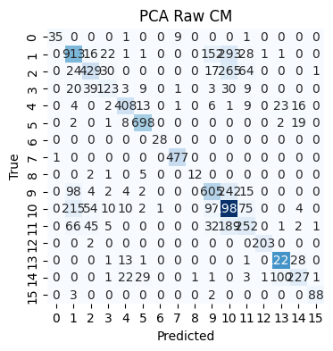
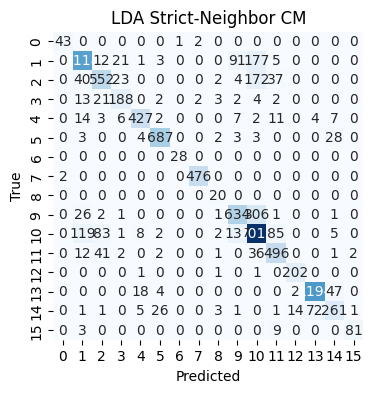
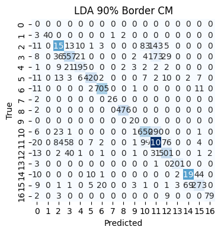
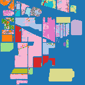
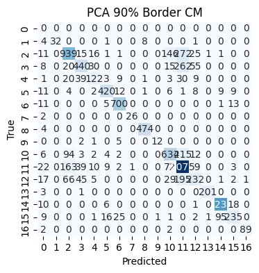
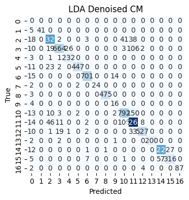
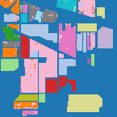
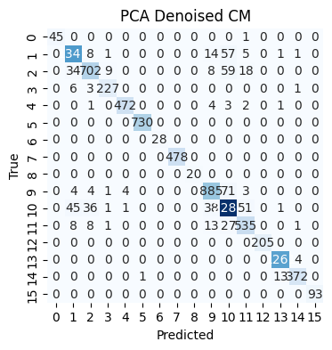

# Classification Results

## Ground Truth


## LDA Raw

**Accuracy:** 0.815





```
precision    recall  f1-score   support

           1      0.915     0.935     0.925        46
           2      0.820     0.775     0.797      1428
           3      0.757     0.663     0.706       830
           4      0.748     0.764     0.756       237
           5      0.910     0.884     0.897       483
           6      0.942     0.937     0.940       730
           7      0.966     1.000     0.982        28
           8      0.992     0.992     0.992       478
           9      0.526     1.000     0.690        20
          10      0.714     0.651     0.681       972
          11      0.738     0.811     0.773      2455
          12      0.763     0.826     0.794       593
          13      0.922     0.985     0.953       205
          14      0.939     0.938     0.938      1265
          15      0.731     0.668     0.698       386
          16      0.964     0.871     0.915        93

    accuracy                          0.815     10249
   macro avg      0.834     0.856     0.840     10249
weighted avg      0.816     0.815     0.814     10249
```

## PCA Raw

**Accuracy:** 0.752




```
precision    recall  f1-score   support

           1      0.972     0.761     0.854        46
           2      0.679     0.639     0.658      1428
           3      0.726     0.517     0.604       830
           4      0.621     0.519     0.566       237
           5      0.868     0.845     0.856       483
           6      0.918     0.956     0.937       730
           7      0.966     1.000     0.982        28
           8      0.977     0.998     0.988       478
           9      0.923     0.600     0.727        20
          10      0.661     0.622     0.641       972
          11      0.661     0.809     0.728      2455
          12      0.551     0.425     0.480       593
          13      0.990     0.990     0.990       205
          14      0.906     0.965     0.935      1265
          15      0.767     0.588     0.666       386
          16      0.967     0.946     0.957        93

    accuracy                          0.752     10249
   macro avg      0.822     0.761     0.785     10249
weighted avg      0.751     0.752     0.747     10249
```

## PCA+Shrinkage LDA

**Accuracy:** 0.790


```
precision    recall  f1-score   support

           0      0.000     0.000     0.000         0
           1      0.534     0.848     0.655        46
           2      0.817     0.737     0.775      1428
           3      0.781     0.613     0.687       830
           4      0.665     0.878     0.756       237
           5      0.937     0.892     0.914       483
           6      0.910     0.956     0.933       730
           7      0.889     0.857     0.873        28
           8      0.991     0.923     0.956       478
           9      0.261     0.300     0.279        20
          10      0.682     0.628     0.654       972
          11      0.703     0.814     0.754      2455
          12      0.733     0.607     0.664       593
          13      0.948     0.976     0.962       205
          14      0.930     0.951     0.940      1265
          15      0.914     0.606     0.729       386
          16      1.000     0.892     0.943        93

    accuracy                          0.790     10249
   macro avg      0.747     0.734     0.734     10249
weighted avg      0.806     0.790     0.793     10249
```

## LDA Strict-Neighbor

**Accuracy:** 0.822




```
precision    recall  f1-score   support

           1      0.956     0.935     0.945        46
           2      0.829     0.783     0.805      1428
           3      0.772     0.665     0.715       830
           4      0.777     0.793     0.785       237
           5      0.920     0.884     0.902       483
           6      0.944     0.941     0.942       730
           7      0.966     1.000     0.982        28
           8      0.992     0.996     0.994       478
           9      0.571     1.000     0.727        20
          10      0.721     0.652     0.685       972
          11      0.742     0.820     0.779      2455
          12      0.767     0.836     0.800       593
          13      0.927     0.985     0.955       205
          14      0.940     0.944     0.942      1265
          15      0.746     0.676     0.709       386
          16      0.964     0.871     0.915        93

    accuracy                          0.822     10249
   macro avg      0.846     0.861     0.849     10249
weighted avg      0.823     0.822     0.821     10249
```

## LDA 90% Border

**Accuracy:** 0.839




```
precision    recall  f1-score   support

           0      0.000     0.000     0.000         0
           1      1.000     0.870     0.930        46
           2      0.871     0.812     0.840      1428
           3      0.803     0.671     0.731       830
           4      0.837     0.823     0.830       237
           5      0.944     0.870     0.905       483
           6      0.960     0.966     0.963       730
           7      0.963     0.929     0.945        28
           8      0.992     0.996     0.994       478
           9      0.625     1.000     0.769        20
          10      0.768     0.669     0.715       972
          11      0.766     0.857     0.809      2455
          12      0.791     0.845     0.817       593
          13      0.976     0.980     0.978       205
          14      0.944     0.947     0.946      1265
          15      0.801     0.707     0.751       386
          16      0.975     0.849     0.908        93

    accuracy                          0.839     10249
   macro avg      0.825     0.811     0.814     10249
weighted avg      0.850     0.839     0.843     10249
```

## PCA 90% Border

**Accuracy:** 0.767





```
precision    recall  f1-score   support

           0      0.000     0.000     0.000         0
           1      1.000     0.696     0.821        46
           2      0.719     0.658     0.687      1428
           3      0.753     0.530     0.622       830
           4      0.646     0.515     0.573       237
           5      0.903     0.870     0.886       483
           6      0.926     0.959     0.942       730
           7      0.963     0.929     0.945        28
           8      0.979     0.992     0.985       478
           9      0.923     0.600     0.727        20
          10      0.698     0.652     0.674       972
          11      0.680     0.845     0.754      2455
          12      0.574     0.391     0.465       593
          13      0.990     0.980     0.985       205
          14      0.920     0.972     0.945      1265
          15      0.839     0.609     0.706       386
          16      0.989     0.957     0.973        93

    accuracy                          0.767     10249
   macro avg      0.794     0.715     0.747     10249
weighted avg      0.776     0.767     0.765     10249
```

## LDA Denoised

**Accuracy:** 0.911




```
precision    recall  f1-score   support

           0      0.000     0.000     0.000         0
           1      1.000     0.891     0.943        46
           2      0.930     0.929     0.929      1428
           3      0.943     0.800     0.866       830
           4      0.896     0.979     0.935       237
           5      0.991     0.925     0.957       483
           6      0.979     0.960     0.970       730
           7      1.000     0.857     0.923        28
           8      0.998     0.994     0.996       478
           9      0.485     0.800     0.604        20
          10      0.841     0.815     0.828       972
          11      0.874     0.924     0.898      2455
          12      0.974     0.889     0.929       593
          13      1.000     0.976     0.988       205
          14      0.956     0.968     0.962      1265
          15      0.921     0.819     0.867       386
          16      1.000     0.935     0.967        93

    accuracy                          0.911     10249
   macro avg      0.870     0.851     0.857     10249
weighted avg      0.925     0.911     0.917     10249
```

## PCA Denoised

**Accuracy:** 0.944





```
precision    recall  f1-score   support

           1      1.000     0.978     0.989        46
           2      0.933     0.939     0.936      1428
           3      0.921     0.846     0.882       830
           4      0.946     0.958     0.952       237
           5      0.990     0.977     0.983       483
           6      0.999     1.000     0.999       730
           7      1.000     1.000     1.000        28
           8      1.000     1.000     1.000       478
           9      1.000     1.000     1.000        20
          10      0.920     0.910     0.915       972
          11      0.913     0.930     0.921      2455
          12      0.870     0.902     0.886       593
          13      1.000     1.000     1.000       205
          14      0.987     0.997     0.992      1265
          15      0.982     0.964     0.973       386
          16      1.000     1.000     1.000        93

    accuracy                          0.944     10249
   macro avg      0.966     0.963     0.964     10249
weighted avg      0.944     0.944     0.944     10249
```
